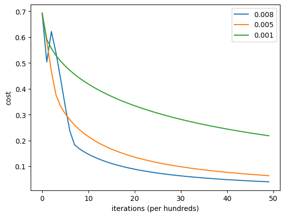

```python
import numpy as np
import matplotlib.pyplot as plt
import h5py
import os
os.chdir("F:\\code\\Deep learning\\吴恩达深度学习作业\\01.机器学习和神经网络\\2.第二周 神经网络基础\\编程作业")
from lr_utils import load_dataset

def load_dataset():
    train_dataset = h5py.File('datasets/train_catvnoncat.h5', "r")
    train_set_x_orig = np.array(train_dataset["train_set_x"][:]) # your train set features
    train_set_y_orig = np.array(train_dataset["train_set_y"][:]) # your train set labels

    test_dataset = h5py.File('datasets/test_catvnoncat.h5', "r")
    test_set_x_orig = np.array(test_dataset["test_set_x"][:]) # your test set features
    test_set_y_orig = np.array(test_dataset["test_set_y"][:]) # your test set labels

    classes = np.array(test_dataset["list_classes"][:]) # the list of classes
    
    train_set_y_orig = train_set_y_orig.reshape((1, train_set_y_orig.shape[0]))
    test_set_y_orig = test_set_y_orig.reshape((1, test_set_y_orig.shape[0]))
    
    return train_set_x_orig, train_set_y_orig, test_set_x_orig, test_set_y_orig, classes


```


```python
train_set_x_orig , train_set_y_orig , test_set_x_orig , test_set_y_orig , classes = load_dataset()
```


```python
train_set_x_orig.shape  # 209张图片，每一张图片是(64,64,3)
```


    (209, 64, 64, 3)


```python
train_set_y_orig  # 保存209张图片是猫(1)，不是猫(0)
```


    array([[0, 0, 1, 0, 0, 0, 0, 1, 0, 0, 0, 1, 0, 1, 1, 0, 0, 0, 0, 1, 0, 0,
            0, 0, 1, 1, 0, 1, 0, 1, 0, 0, 0, 0, 0, 0, 0, 0, 1, 0, 0, 1, 1, 0,
            0, 0, 0, 1, 0, 0, 1, 0, 0, 0, 1, 0, 1, 1, 0, 1, 1, 1, 0, 0, 0, 0,
            0, 0, 1, 0, 0, 1, 0, 0, 0, 0, 0, 0, 0, 0, 0, 0, 0, 1, 1, 0, 0, 0,
            1, 0, 0, 0, 1, 1, 1, 0, 0, 1, 0, 0, 0, 0, 1, 0, 1, 0, 1, 1, 1, 1,
            1, 1, 0, 0, 0, 0, 0, 1, 0, 0, 0, 1, 0, 0, 1, 0, 1, 0, 1, 1, 0, 0,
            0, 1, 1, 1, 1, 1, 0, 0, 0, 0, 1, 0, 1, 1, 1, 0, 1, 1, 0, 0, 0, 1,
            0, 0, 1, 0, 0, 0, 0, 0, 1, 0, 1, 0, 1, 0, 0, 1, 1, 1, 0, 0, 1, 1,
            0, 1, 0, 1, 0, 0, 0, 0, 0, 1, 0, 0, 1, 0, 0, 0, 1, 0, 0, 0, 0, 1,
            0, 0, 1, 0, 0, 0, 0, 0, 0, 0, 0]], dtype=int64)


```python
test_set_x_orig.shape  # 测试集里的50张图片
```


    (50, 64, 64, 3)


```python
test_set_y_orig  #测试集里判断01
```


    array([[1, 1, 1, 1, 1, 0, 1, 1, 1, 1, 1, 1, 1, 0, 0, 1, 0, 1, 1, 1, 1, 0,
            0, 1, 1, 1, 1, 0, 1, 0, 1, 1, 1, 1, 0, 0, 0, 1, 0, 0, 1, 1, 1, 0,
            0, 0, 1, 1, 1, 0]], dtype=int64)


```python
classes
```


    array([b'non-cat', b'cat'], dtype='|S7')


```python
index = 56
plt.imshow(train_set_x_orig[index])  # 预览图片
```


    <matplotlib.image.AxesImage at 0x287798fdcc0>


    

    


```python
#打印出当前的训练标签值
#使用np.squeeze的目的是压缩维度，【未压缩】train_set_y[:,index]的值为[1] , 【压缩后】np.squeeze(train_set_y[:,index])的值为1
#print("【使用np.squeeze：" + str(np.squeeze(train_set_y[:,index])) + "，不使用np.squeeze： " + str(train_set_y[:,index]) + "】")
#只有压缩后的值才能进行解码操作
print("y = " + str(train_set_y_orig[0,index]) + ", it's a " + classes[np.squeeze(train_set_y_orig[0,index])].decode("utf-8") + " picture")
```

    y = 1, it's a cat picture
    


```python
m_train = train_set_y_orig.shape[1] #训练集图片数量
m_train
```


    209


```python
m_test = test_set_y_orig.shape[1]  # 测试集图片数量
m_test
```


    50


```python
num_px = train_set_x_orig.shape[1] # 数据图片的宽度和高度
num_px
```


    64


```python
# 重新构造numpy数组每列代表一个图像
# 把形状从(a,b,c,d)平铺成(b*c*d,a)
train_set_x_flatten = train_set_x_orig.reshape(train_set_x_orig.shape[0],-1).T
train_set_x_flatten.shape
```


    (12288, 209)


```python
test_set_x_flatten = test_set_x_orig.reshape(test_set_x_orig.shape[0],-1).T
test_set_x_flatten.shape
```


    (12288, 50)


```python
# 居中和标准化，对于图像数据除以255
train_set_x = train_set_x_flatten/255
test_set_x = test_set_x_flatten/255
```


```python
# sigmoid函数
def sigmoid(z):
    s = 1/(1+np.exp(-z))
    return s

# 测试sigmoid
x = np.array([1,2,3,4,5])
sigmoid(0),sigmoid(9.2),sigmoid(x)
```


    (0.5,
     0.9998989708060922,
     array([0.73105858, 0.88079708, 0.95257413, 0.98201379, 0.99330715]))


```python
# 初始化w和b
def initialize_with_zeros(dim):
    """
    dim： （num_px*num_px*3,1）.[0]
    """
    w = np.zeros(shape=(dim,1)) # （dim，1）
    b = 0
    assert(w.shape == (dim,1))
    assert(isinstance(b,float) or isinstance(b,int))
    
    return w,b
```


```python
# 传播与计算成本函数
def propagate(w,b,X,Y):
    """
    paramters：
        w：[w1,w2,w3,...wn]  有n个样本特征
        b：scalar
        X: 矩阵类型(num_px*num_px*3,训练数量)
        Y: 标签(1,训练数量)
    
    returns：
        grads: 字典，记录了 dw和db
        cost： 记录损失
    """
    m = X.shape[1] # 训练数量
    
    # 正向传播：计算
    A = sigmoid(np.dot(w.T,X)+b) # 每个样本特征（行）与每个图片数据（列）分别做点积 （生成了[1,2,3,4]）+ b（广播机制） => [w.T*x1+b,w.T*x2+b  ... w.T*xn+b]
    cost = -(np.sum(Y*np.log(A) + (1-Y)*np.log(1-A)))/m # 成本函数的计算
    
    # 反向传播：求导
    dw = (np.dot(X,(A-Y).T))/m
    db = (np.sum(A-Y))/m
    
    assert(dw.shape == w.shape)
    assert(db.dtype == float)
    cost = np.squeeze(cost)
    assert(cost.shape==())
    
    grads = {
        "dw":dw,
        "db":db
    }
    return grads, cost
```


```python
#测试一下propagate
print("====================测试propagate====================")
#初始化一些参数
w, b, X, Y = np.array([[1], [2]]), 2, np.array([[1,2], [3,4]]), np.array([[1, 0]])
grads, cost = propagate(w, b, X, Y)
print ("dw = " + str(grads["dw"]))
print ("db = " + str(grads["db"]))
print ("cost = " + str(cost))
print ("grads = " + str(grads))
```

    ====================测试propagate====================
    dw = [[0.99993216]
     [1.99980262]]
    db = 0.49993523062470574
    cost = 6.000064773192205
    grads = {'dw': array([[0.99993216],
           [1.99980262]]), 'db': 0.49993523062470574}
    


```python
# 优化参数
def optimize(w,b,X,Y,num_iterations,learning_rate,print_cost=True):
    """
     paramters：
        w：[w1,w2,w3,...wn]  有n个样本特征
        b：scalar
        X: 矩阵类型(num_px*num_px*3,训练数量)
        Y: 标签(1,训练数量)
        num_iterations: 迭代次数，做优化
        learning_rate：自定义的学习率
        
    """
    costs = []
    for i in range(num_iterations): # 优化的超参数
        grads, cost = propagate(w,b,X,Y) 
        
        dw = grads['dw']
        db = grads['db']
        
        # 更新w和b
        w = w-learning_rate*dw
        b = b-learning_rate*db
        
        # 记录成本
        if i%100 ==0:
            costs.append(cost) 
        # 打印成本
        if print_cost==True and i%100==0:
            print(f"迭代次数: {i}，误差值: {cost}")
    
    params = {
        'w':w,
        'b':b
    }
    grads = {
        "dw":dw,
        "db":db
    }
    return params,grads,costs
```


```python
#测试optimize
print("====================测试optimize====================")
w, b, X, Y = np.array([[1], [2]]), 2, np.array([[1,2], [3,4]]), np.array([[1, 0]])
params , grads, costs = optimize(w , b , X , Y , num_iterations=100 , learning_rate = 0.009 , print_cost = True)
print ("w = " + str(params["w"]))
print ("b = " + str(params["b"]))
print ("dw = " + str(grads["dw"]))
print ("db = " + str(grads["db"]))
```

    ====================测试optimize====================
    迭代次数: 0，误差值: 6.000064773192205
    w = [[0.1124579 ]
     [0.23106775]]
    b = 1.5593049248448891
    dw = [[0.90158428]
     [1.76250842]]
    db = 0.4304620716786828
    


```python
# 预测结果
def predict(w , b , X ):
    """
    paramters:
        w：[w1,w2,w3,...wn]  有n个样本特征
        b：scalar
        X: 矩阵类型(num_px*num_px*3,训练数量)
    """
    m  = X.shape[1] #图片的数量
    Y_prediction = np.zeros((1,m)) # [0,0,0,0 ... 0] 
    w = w.reshape(X.shape[0],1) # 第一张图片作为初始数据w
    
    #计预测猫在图片中出现的概率
    A = sigmoid(np.dot(w.T , X) + b) # 获得预测值
    for i in range(A.shape[1]):
        #将概率a [0，i]转换为实际预测p [0，i]
        Y_prediction[0,i] = 1 if A[0,i] > 0.5 else 0
    #使用断言
    assert(Y_prediction.shape == (1,m))
    
    return Y_prediction

```


```python
def model(X_train , Y_train , X_test , Y_test , num_iterations = 2000 , learning_rate = 0.5 , print_cost = True):
    """
    paramters:
        X_train：（num_px * num_px * 3，m_train）的训练集
        Y_train：（1，m_train）的训练标签集
        X_test：（num_px * num_px * 3，m_train）的测试集
        Y_test：（1，m_train）的测试标签集
        num_iterations: 迭代次数
        learning_rate：学习率
        print_cost: 是否打印信息
        
    returns:
        d: 信息字典
    """
    
    w , b = initialize_with_zeros(X_train.shape[0]) # 获得初始化后的w（shape：(num_px*num_px*3,1)）和b:scalar
    
    parameters , grads, costs = optimize(w , b , X_train , Y_train,num_iterations , learning_rate , print_cost)
    
    #从字典“参数”中检索参数w和b
    w , b = parameters["w"] , parameters["b"]
    
    #预测测试/训练集的例子
    Y_prediction_test = predict(w , b, X_test)
    Y_prediction_train = predict(w , b, X_train)
    
    #打印训练后的准确性
    print("训练集准确性："  , format(100 - np.mean(np.abs(Y_prediction_train - Y_train)) * 100) ,"%")
    print("测试集准确性："  , format(100 - np.mean(np.abs(Y_prediction_test - Y_test)) * 100) ,"%")
    
    d = {
            "costs": costs,
            "Y_prediction_test" : Y_prediction_test,
            "Y_prediciton_train" : Y_prediction_train,
            "w" : w,
            "b" : b,
            "learning_rate" : learning_rate,
            "num_iterations" : num_iterations }
    return d


```


```python
print("====================测试model====================")     
#这里加载的是真实的数据，请参见上面的代码部分。
learn_rates = [0.008,0.005,0.001]
d1 = model(train_set_x, train_set_y_orig, test_set_x, test_set_y_orig, num_iterations = 5000, learning_rate = learn_rates[0], print_cost = True)
d2 = model(train_set_x, train_set_y_orig, test_set_x, test_set_y_orig, num_iterations = 5000, learning_rate = learn_rates[1], print_cost = True)
d3 = model(train_set_x, train_set_y_orig, test_set_x, test_set_y_orig, num_iterations = 5000, learning_rate = learn_rates[2], print_cost = True)
```

    ====================测试model====================
    迭代次数: 0，误差值: 0.6931471805599453
    迭代次数: 100，误差值: 0.5040206679162571
    迭代次数: 200，误差值: 0.6216749014225869
    迭代次数: 300，误差值: 0.5389833486356592
    迭代次数: 400，误差值: 0.43788373851420564
    迭代次数: 500，误差值: 0.3322113233727608
    迭代次数: 600，误差值: 0.23620057057572189
    迭代次数: 700，误差值: 0.18365297522472962
    迭代次数: 800，误差值: 0.16848465645417982
    迭代次数: 900，误差值: 0.15685167441345804
    迭代次数: 1000，误差值: 0.14680664440604652
    迭代次数: 1100，误差值: 0.13797061897416513
    迭代次数: 1200，误差值: 0.13011258680754056
    迭代次数: 1300，误差值: 0.12307038626764506
    迭代次数: 1400，误差值: 0.11672101852109178
    迭代次数: 1500，误差值: 0.11096706076157613
    迭代次数: 1600，误差值: 0.105729323701898
    迭代次数: 1700，误差值: 0.10094234180730925
    迭代次数: 1800，误差值: 0.09655133800385143
    迭代次数: 1900，误差值: 0.09251004952966674
    迭代次数: 2000，误差值: 0.08877910431302512
    迭代次数: 2100，误差值: 0.0853247736332595
    迭代次数: 2200，误差值: 0.08211799451977582
    迭代次数: 2300，误差值: 0.07913359213449225
    迭代次数: 2400，误差值: 0.07634965405048229
    迭代次数: 2500，误差值: 0.07374702198973997
    迭代次数: 2600，误差值: 0.0713088756559529
    迭代次数: 2700，误差值: 0.06902038958296677
    迭代次数: 2800，误差值: 0.06686844841191321
    迭代次数: 2900，误差值: 0.06484140929897517
    迭代次数: 3000，误差值: 0.06292890260913477
    迭代次数: 3100，误差值: 0.06112166390871995
    迭代次数: 3200，误差值: 0.05941139169311675
    迭代次数: 3300，误差值: 0.057790626388264446
    迭代次数: 3400，误差值: 0.05625264702560244
    迭代次数: 3500，误差值: 0.05479138266803419
    迭代次数: 3600，误差值: 0.053401336201914056
    迭代次数: 3700，误差值: 0.05207751853886146
    迭代次数: 3800，误差值: 0.050815391615328026
    迭代次数: 3900，误差值: 0.04961081885550409
    迭代次数: 4000，误差值: 0.04846002198832504
    迭代次数: 4100，误差值: 0.047359543292813014
    迭代次数: 4200，误差值: 0.04630621249616293
    迭代次数: 4300，误差值: 0.04529711767241693
    迭代次数: 4400，误差值: 0.04432957959144395
    迭代次数: 4500，误差值: 0.04340112905234147
    迭代次数: 4600，误差值: 0.042509486805556405
    迭代次数: 4700，误差值: 0.041652545726590794
    迭代次数: 4800，误差值: 0.04082835495319377
    迭代次数: 4900，误差值: 0.040035105739139216
    训练集准确性： 100.0 %
    测试集准确性： 68.0 %
    迭代次数: 0，误差值: 0.6931471805599453
    迭代次数: 100，误差值: 0.5845083636993086
    迭代次数: 200，误差值: 0.46694904094655476
    迭代次数: 300，误差值: 0.37600686694802093
    迭代次数: 400，误差值: 0.33146328932825125
    迭代次数: 500，误差值: 0.30327306747438293
    迭代次数: 600，误差值: 0.27987958658260487
    迭代次数: 700，误差值: 0.2600421369258757
    迭代次数: 800，误差值: 0.2429406846779662
    迭代次数: 900，误差值: 0.2280042225672606
    迭代次数: 1000，误差值: 0.2148195137844964
    迭代次数: 1100，误差值: 0.20307819060644988
    迭代次数: 1200，误差值: 0.19254427716706862
    迭代次数: 1300，误差值: 0.18303333796883506
    迭代次数: 1400，误差值: 0.17439859438448874
    迭代次数: 1500，误差值: 0.1665213970540033
    迭代次数: 1600，误差值: 0.15930451829756612
    迭代次数: 1700，误差值: 0.15266732471296504
    迭代次数: 1800，误差值: 0.14654223503982342
    迭代次数: 1900，误差值: 0.1408720757031016
    迭代次数: 2000，误差值: 0.13560807525912016
    迭代次数: 2100，误差值: 0.13070832130477314
    迭代次数: 2200，误差值: 0.12613655733642845
    迭代次数: 2300，误差值: 0.12186123310162926
    迭代次数: 2400，误差值: 0.11785474652704071
    迭代次数: 2500，误差值: 0.114092832269271
    迭代次数: 2600，误差值: 0.11055406382501501
    迭代次数: 2700，误差值: 0.10721944457861762
    迭代次数: 2800，误差值: 0.10407206923216956
    迭代次数: 2900，误差值: 0.10109684147524374
    迭代次数: 3000，误差值: 0.09828023699678214
    迭代次数: 3100，误差值: 0.09561010335573057
    迭代次数: 3200，误差值: 0.09307549004229355
    迭代次数: 3300，误差值: 0.09066650344102876
    迭代次数: 3400，误差值: 0.0883741824656432
    迭代次数: 3500，误差值: 0.08619039145561948
    迭代次数: 3600，误差值: 0.08410772756609211
    迭代次数: 3700，误差值: 0.08211944038800706
    迭代次数: 3800，误差值: 0.08021936193738763
    迭代次数: 3900，误差值: 0.0784018454741722
    迭代次数: 4000，误差值: 0.0766617118703419
    迭代次数: 4100，误差值: 0.0749942024573522
    迭代次数: 4200，误差值: 0.07339493745449006
    迭代次数: 4300，误差值: 0.07185987922058308
    迭代次数: 4400，误差值: 0.07038529968762712
    迭代次数: 4500，误差值: 0.06896775143115179
    迭代次数: 4600，误差值: 0.06760404191228078
    迭代次数: 4700，误差值: 0.06629121049345106
    迭代次数: 4800，误差值: 0.06502650788600448
    迭代次数: 4900，误差值: 0.06380737773526819
    训练集准确性： 100.0 %
    测试集准确性： 70.0 %
    迭代次数: 0，误差值: 0.6931471805599453
    迭代次数: 100，误差值: 0.5912894260003538
    迭代次数: 200，误差值: 0.5557961107127088
    迭代次数: 300，误差值: 0.5289765131562366
    迭代次数: 400，误差值: 0.5068812917435517
    迭代次数: 500，误差值: 0.48787986321716575
    迭代次数: 600，误差值: 0.47110827803124367
    迭代次数: 700，误差值: 0.4560458096982852
    迭代次数: 800，误差值: 0.4423502279336529
    迭代次数: 900，误差值: 0.4297817153507784
    迭代次数: 1000，误差值: 0.41816382093643273
    迭代次数: 1100，误差值: 0.40736174995821917
    迭代次数: 1200，误差值: 0.3972694687269799
    迭代次数: 1300，误差值: 0.3878016072295409
    迭代次数: 1400，误差值: 0.3788881303593958
    迭代次数: 1500，误差值: 0.3704706898360003
    迭代次数: 1600，误差值: 0.36250004228346355
    迭代次数: 1700，误差值: 0.35493416988240534
    迭代次数: 1800，误差值: 0.34773687946679727
    迭代次数: 1900，误差值: 0.34087673680743863
    迭代次数: 2000，误差值: 0.3343262415502278
    迭代次数: 2100，误差值: 0.32806117866200263
    迭代次数: 2200，误差值: 0.32206010177265726
    迭代次数: 2300，误差值: 0.31630391670931673
    迭代次数: 2400，误差值: 0.31077554225448734
    迭代次数: 2500，误差值: 0.305459631201922
    迭代次数: 2600，误差值: 0.3003423390438106
    迭代次数: 2700，误差值: 0.2954111306790215
    迭代次数: 2800，误差值: 0.2906546177593987
    迭代次数: 2900，误差值: 0.28606242093772705
    迭代次数: 3000，误差值: 0.2816250525142801
    迭代次数: 3100，误差值: 0.2773338159136979
    迭代次数: 3200，误差值: 0.27318071914032865
    迭代次数: 3300，误差值: 0.2691583999146918
    迭代次数: 3400，误差值: 0.26526006062693924
    迭代次数: 3500，误差值: 0.26147941158452703
    迭代次数: 3600，误差值: 0.25781062130237786
    迭代次数: 3700，误差值: 0.25424827280064344
    迭代次数: 3800，误差值: 0.25078732504979767
    迭代次数: 3900，误差值: 0.24742307884430276
    迭代次数: 4000，误差值: 0.24415114650144543
    迭代次数: 4100，误差值: 0.2409674248764928
    迭代次数: 4200，误差值: 0.2378680712632095
    迭代次数: 4300，误差值: 0.2348494818132727
    迭代次数: 4400，误差值: 0.23190827216175136
    迭代次数: 4500，误差值: 0.2290412599906218
    迭代次数: 4600，误差值: 0.2262454492998644
    迭代次数: 4700，误差值: 0.22351801618733247
    迭代次数: 4800，误差值: 0.22085629596532616
    迭代次数: 4900，误差值: 0.21825777146449288
    训练集准确性： 96.65071770334929 %
    测试集准确性： 74.0 %
    


```python
costs1 = np.squeeze(d1['costs'])
costs2 = np.squeeze(d2['costs'])
costs3 = np.squeeze(d3['costs'])
plt. plot(costs1,label=str(d1["learning_rate"]))
plt. plot(costs2,label=str(d2["learning_rate"]))
plt. plot(costs3,label=str(d3["learning_rate"]))
plt.ylabel('cost')
plt.xlabel('iterations (per hundreds)')
plt.legend()
plt.show()
```


    

    


```python

```
